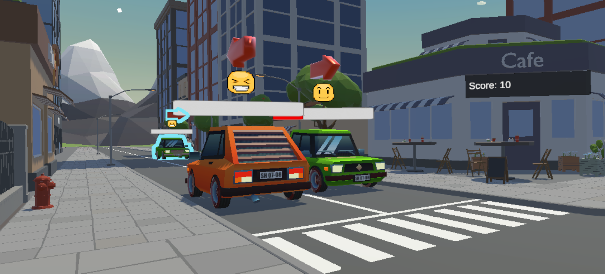
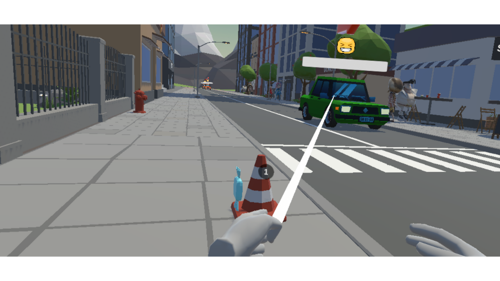
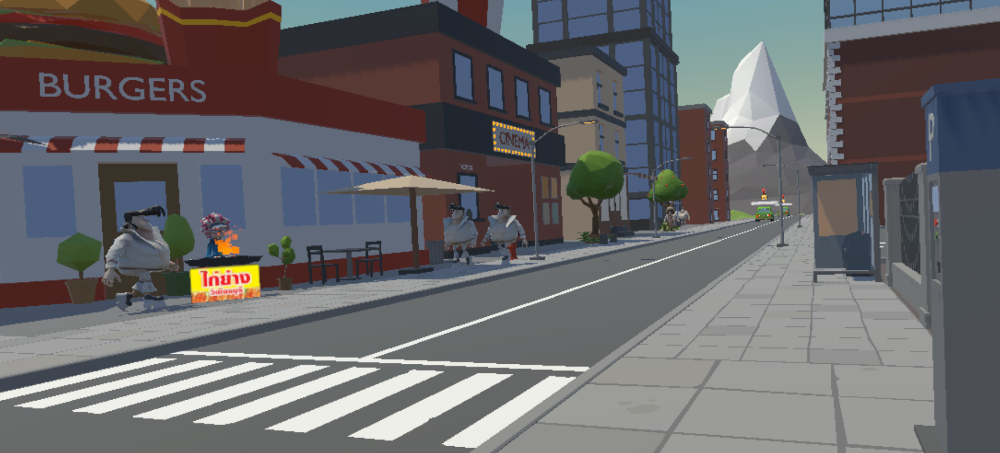

# Crazy-Traffic
The Crazy Traffic project is developed to learn how to develop a VR game using Unity. The game simulates as a traffic signal operator and aims to teach hand signals for cars in a virtual world.

## Project Status
*This project is currently under development.*

## Installation
1. Clone the repository.
2. Open the project in Unity.
3. Build and run the game on Oculus Quest 2.

## Gameplay
The player must control the movement of cars from all lanes (Top, Left, and Right) to their target lane for avoiding a crash. The player can stop a car but emotion value of stopped car will increase and will unvaiable to control when it's reach a max of guage and get crazy. Moreover, the player can release a stopped car to avoid them from getting crazy. And do not worry if a car nearly to get crazy, the player can use special items to remove all emotion values of all cars in a specific lane. The scores will increase when cars can go to their target lane. If crashing occur in the scene, GAMEOVER.

## Controls
The player can control the car using the Oculus Quest 2 controllers. The left controller is used to point to car which want to stop or release, while the right controller is used to control a hand for stop a car, releasing a car, and using special items.

## Screenshot

## Demo Video

