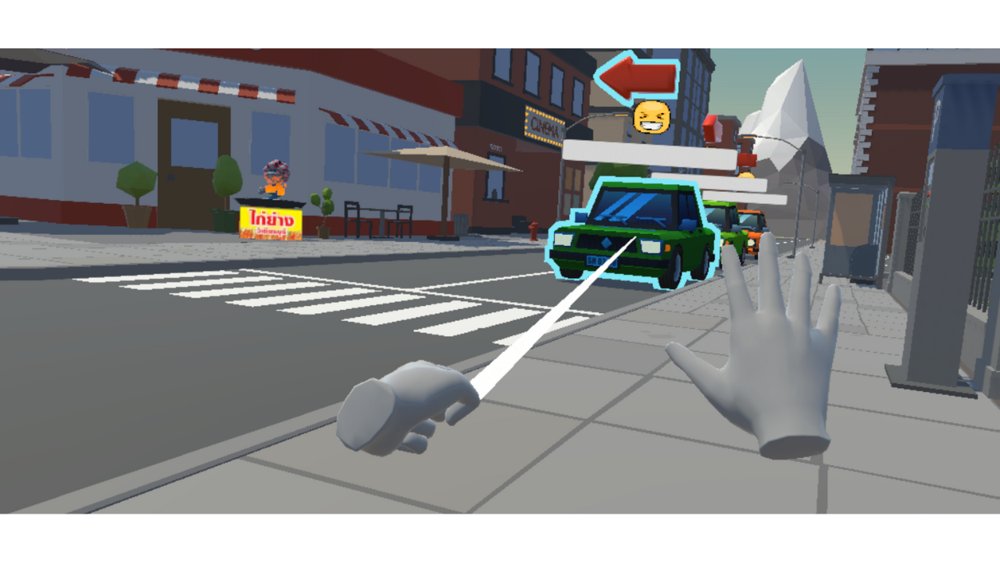
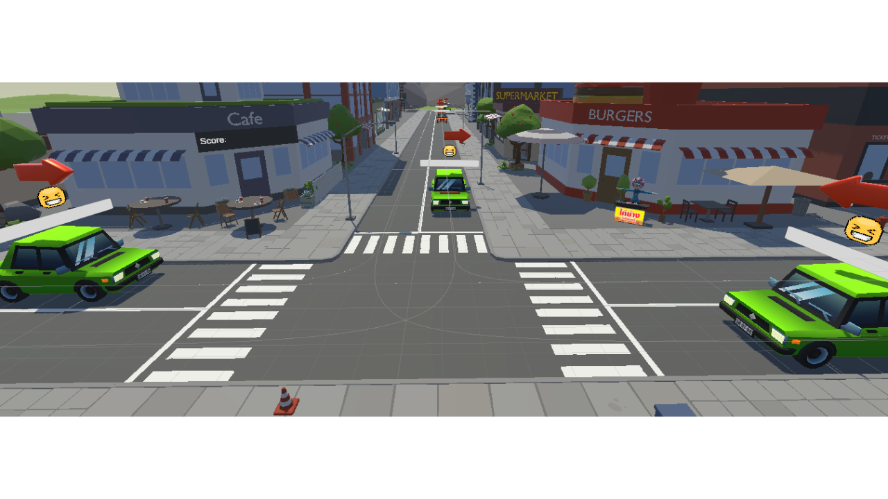

# Crazy-Traffic
The Crazy Traffic project is developed to learn how to develop a VR game using Unity. The game simulates a traffic signal operator and aims to teach hand signals for cars in a virtual world.

## Project Status
*This project is currently under development.*

## Screenshot

